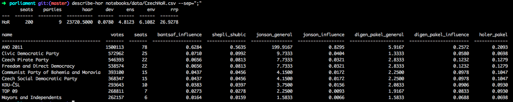

# parliament
Lightweight util to get usefull descriptive statistics for House of Representatives (Parliament)

## Shell script


## Python API
```python
import pandas as pd
import parliament
data = pd.read_csv('data/CzechHoR.csv', sep=';')
# file: data/CzechHoR.csv
#
# abbr;name;votes;seats
# ANO;ANO 2011;1500113;78
# ODS & SsCR;Civic Democratic Party;572962;25
# ...
hor = parliament.read.hor_from_df(data, name='abbr')
print(*hor.parties, sep='\n')

#> Party(name='ANO', votes=1500113, seats=78)
#> Party(name='ODS & SsCR', votes=572962, seats=25)
#> Party(name='Pirati', votes=546393, seats=22)
#> Party(name='SPD', votes=538574, seats=22)
#> Party(name='KSCM', votes=393100, seats=15)
#> Party(name='CSSD', votes=368347, seats=15)
#> Party(name='KDU-CSL', votes=293643, seats=10)
#> Party(name='TOP 09', votes=268811, seats=7)
#> Party(name='STAN', votes=262157, seats=6)

party0 = hor.parties[0]
print(hor.bantsaf_influence(party0))

# 0.6284153005464481

print(hor.map_stat('bantsaf_influence'))
#> {'ANO': 0.6284153005464481,
#> 'CSSD': 0.04371584699453552,
#> 'KDU-CSL': 0.03825136612021858,
#> 'KSCM': 0.04371584699453552,
#> 'ODS & SsCR': 0.07103825136612021,
#> 'Pirati': 0.06557377049180328,
#> 'SPD': 0.06557377049180328,
#> 'STAN': 0.01639344262295082,
#> 'TOP 09': 0.0273224043715847}

# Other statistics can be also collected
print(parliament.stats.__all__)
#> ['haar',
#>  'dev',
#>  'ens',
#>  'env',
#>  'rrp',
#>  'bantsaf_influence',
#>  'shepli_shubic',
#>  'jonson_general',
#>  'jonson_influence',
#>  'digen_pakel_general',
#>  'digen_pakel_influence',
#>  'holer_pakel']

print(hor.haar())
#> 23720.5

# To get beautiful table as in shell script use
print(hor.describe())
#> --Beautiful table here--

# For manual party creation use API
parties = [parliament.Party(name='ANO', votes=1500113, seats=78)
           parliament.Party(name='ODS & SsCR', votes=572962, seats=25)]
hor1 = parliament.HoR(parties=parties, name='My HoR')           
```
